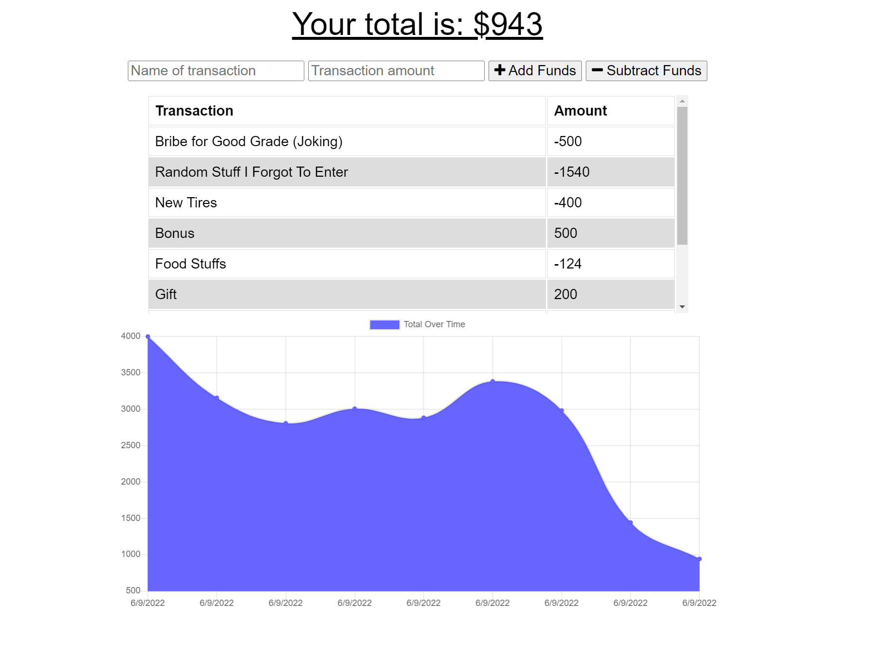

# Budget-Tracker-PWA

## User Story
- AS AN avid traveler
- I WANT to be able to track my withdrawals and deposits with or without a data/internet connection
- SO THAT my account balance is accurate when I am traveling 

## Acceptance Criteria
- GIVEN a budget tracker without an internet connection
- WHEN the user inputs an expense or deposit
- THEN they will receive a notification that they have added an expense or deposit
- WHEN the user reestablishes an internet connection
- THEN the deposits or expenses added while they were offline are added to their transaction history and their totals are updated

## Link to Code
- http://github/jamesbelk0/Budget--Tracker-PWA

## Link to Deployed Site (Heroku)
- https://obscure-coast-43625.herokuapp.com/

## Screenshot of the Budget Tracker
- 

## Description
- This app will help the user keep track of their budget on the road! Quick and easy UI that gives a clear snapshot of where their account is currently. This app comes with offline capabilities so the user can still function and keep an eye out even if they are out of civilization or off the grid! To put a finer touch on the budget tracker the app can be downloaded to the users homescreen for an easier way to access their information. 

## Installation
- Node.js
- Express.js
- MongoDB
- Heroku

## Contributor
- James Belk

## Questions
If there are any issues or questions, please contact at:
- <jamesbelk0@gmail.com>
- [GitHub](https://github.com/jamesbelk0)